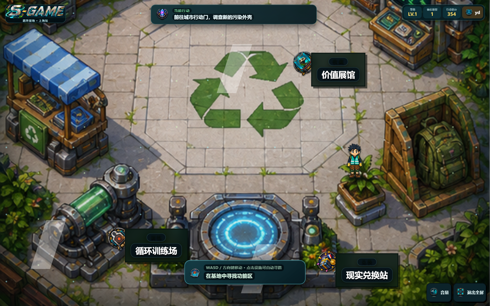
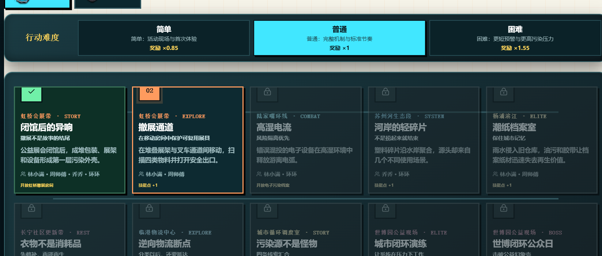
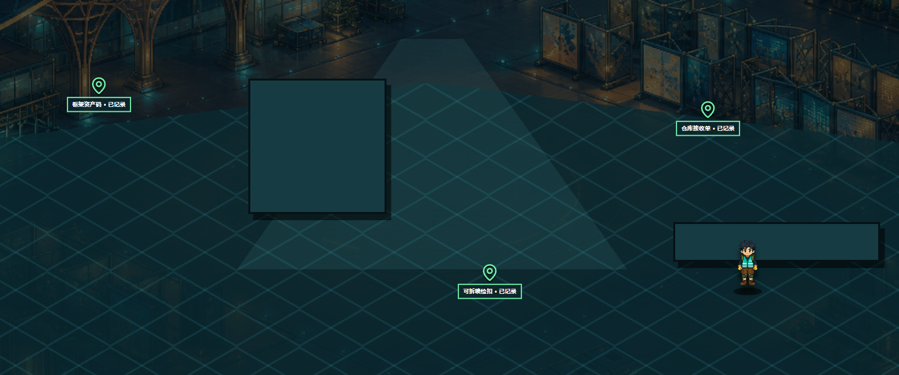
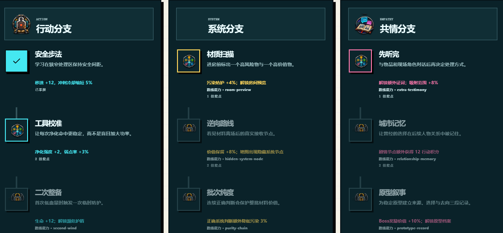
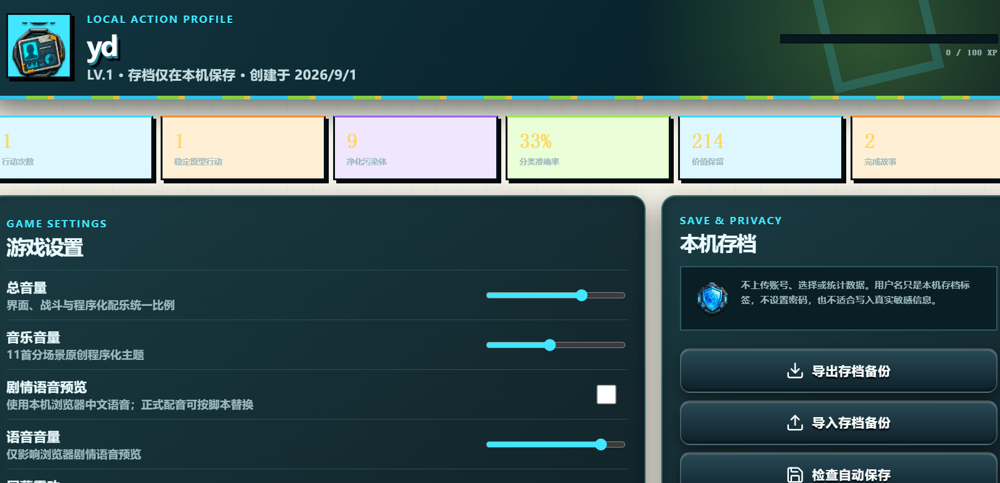
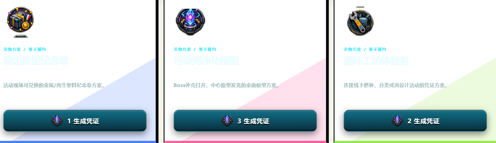
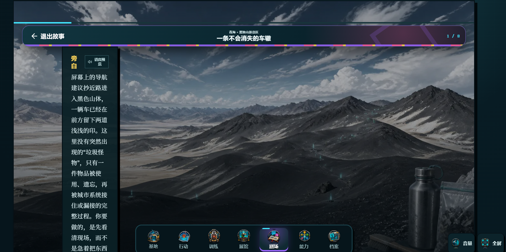
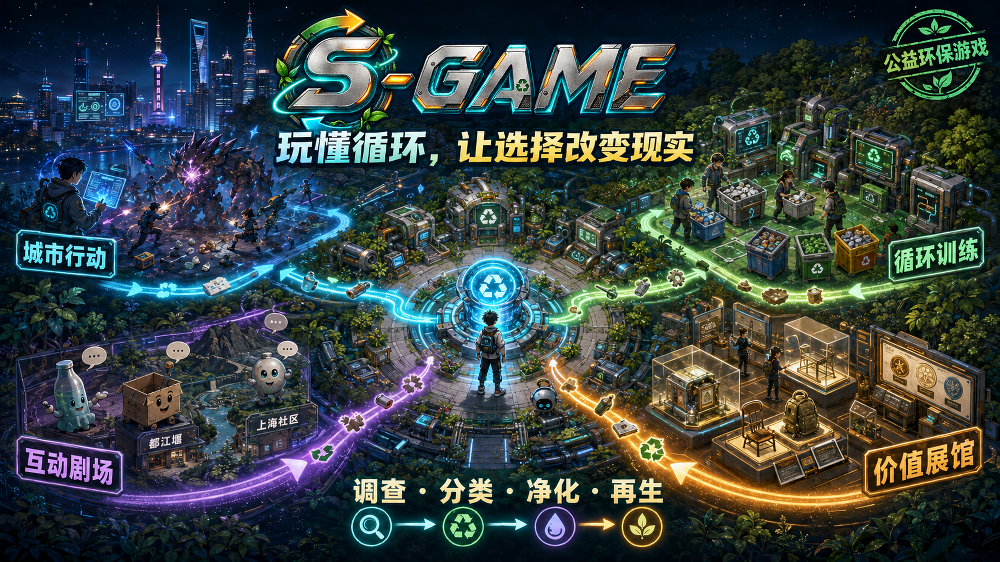
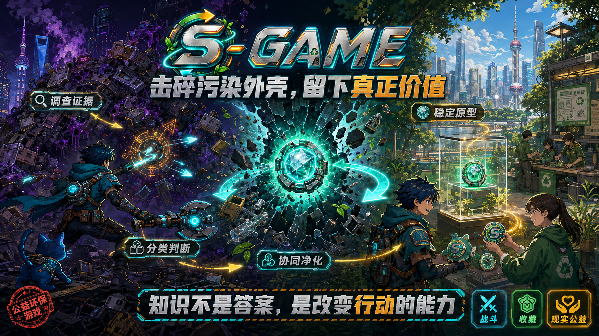
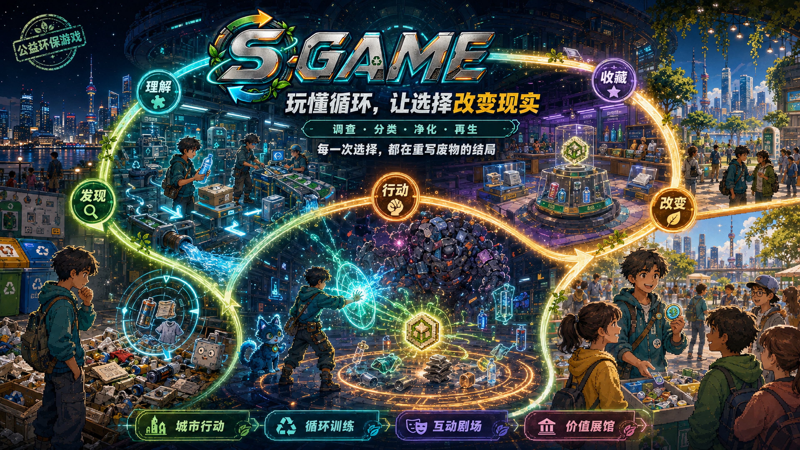

# S-GAME · 循环基地

> 玩懂循环，让选择改变现实。

S-GAME 是一款面向青年、公益活动和展会现场试玩的中文环境教育动作肉鸽游戏。玩家进入一座可自由行走的循环基地，在上海城市行动、互动剧场、循环训练和价值展馆之间移动：先调查证据，再判断风险与材料状态，击破由错误流转形成的污染外壳，保留下来的稳定原型最终可以连接到线下纪念品和公益体验。

它不是把环保知识贴在战斗之后的答题页面，而是把“调查 · 分类 · 净化 · 再生”做成一条可游玩的闭环。

## 60 秒了解 S-GAME

1. 用用户名进入游戏，用户名只作为本机存档标签，不需要邮箱或密码。
2. 在循环基地中行走，靠近设施或点击设施自动寻路。
3. 进入城市行动门，查看本局进度，寻找证据并选择行动路线。
4. 在探索、分类、护送或解谜房间中移动和互动，再进入污染外壳战斗。
5. 使用低强度自动攻击、鼠标/触控主动攻击、法阵、冲刺和终结技完成净化。
6. 收集材料和稳定原型，回到展馆查看材料护照，或在现实兑换站生成线下方案凭证。

## 产品亮点

### 可探索的循环基地

主页不是一组菜单卡片，而是一张可以走进去的基地地图。城市行动门、装备工坊、循环能力台、价值展馆、循环剧场、行动档案室、循环训练场和现实兑换站都被设计成基地中的真实设施。

### 教育与玩法同场发生

玩家在战斗中要处理的不只是“打掉多少血”，还要识别材料状态、控制污染扩散、保护批次价值、确认交接去向，并理解为什么某些看似省事的选择会把成本转移给保洁员、运输人员、接收机构或自然环境。

### 适合现场试玩，也支持个人长期游玩

体验难度、标准难度和挑战难度可以按观众水平切换；顶部进度条显示本局推进，不用倒计时强迫玩家跳过剧情。展会模式支持长时间无人操作自动重置，个人模式则保留本机存档、故事进度、能力成长和装备构筑。

## 八个功能区

| 功能区 | 玩家在这里做什么 | 体验亮点 |
| --- | --- | --- |
| 城市行动门 | 进入上海十节点主线，调查证据、探索房间、战斗、选择路线并挑战 Boss | 让“污染外壳”对应真实的混投、失联、潮湿、逸散和过量物料问题 |
| 循环训练场 | 走动、拾取、扫描、分类、护送、启动机关和完成复核 | 11 套专项玩法，每套三个连续房间，不是静态答题 |
| 装备工坊 | 装配武器、头盔、护甲和鞋靴，比较套装效果 | 4 套装备、8 种武器，主动点击方式各不相同 |
| 循环能力台 | 在行动、系统、共情三条能力树上分配技能点 | 24 个节点同时影响战斗、训练、剧情和价值保留 |
| 循环剧场 | 阅读并选择回复，听废弃物讲述自己的使用与流转经历 | 52 篇约 2–3 分钟故事，至少 8 段剧情与 2 次玩家选择 |
| 价值展馆 | 查看材料护照、稳定原型、收藏品和物品第一人称故事 | 先显示轮廓与线索，再通过行动和剧情解锁真实展品 |
| 行动档案室 | 查看个人行动、净化、分类、故事和价值保留记录 | 不做排行榜，用个人成长记录替代单一击杀统计 |
| 现实兑换站 | 用原型碎片生成纪念章、净化模型或循环工坊体验券方案 | 当前只生成本机演示凭证，不虚构真实物流或打印履约 |

## 城市行动：一条连续的上海环境叙事

上海篇不是互相独立的关卡列表，而是十个连续节点：

- **闭馆后的异响**：从虹桥会展撤场开始，追查展架、包装和设备为什么在闭馆后变成混合物。
- **撤展通道**：扫描资产码、仓库接收单和可拆喷绘扣，让可复用展具找到下一场用途。
- **高湿电流**：在陆家嘴地下回收间识别断电、鼓包电池和数据擦除风险，学习“停、隔、报、记”。
- **河岸的轻碎片**：沿苏州河寻找塑料源头，比较减量、重复使用、分材和末端清理的先后顺序。
- **潮纸档案室**：在杨浦滨江保护干燥纸材，分离隐私页和油污批次，再处理湿纸精英。
- **衣物不是消耗品**：在长宁社区维修、交换和捐赠之间做判断，先保留可继续使用的功能。
- **逆向物流断点**：在临港护送正确分类的材料，面对错单、雨水和返程容量造成的流转损失。
- **污染源不是怪物**：把采购、使用、回收和传播四条证据链重新拼起来。
- **城市闭环演练**：在世博园公益现场同时管理物料、人流、志愿者口径和兑换承诺。
- **世博闭环公众日**：击破以环保口号为外表、却不断制造无计划赠品的公益幻象壳。

### 剧情如何融入上海法规

游戏采用《上海市生活垃圾管理条例》和《上海市生活垃圾分类投放指引（2024版）》作为上海篇的规则底座。2024版指引覆盖居住区、单位、商业、文化、旅游和其他公共场所，并明确可回收物、有害垃圾、湿垃圾、干垃圾的分类定义、容器配置、投放要求和收运衔接。[查看上海市绿化和市容管理局原文](https://lhsr.sh.gov.cn/srgl/20240806/40b9feaa-53db-472f-8a6b-2c3cf0465def.html)

法规不会以大段文字弹窗出现，而是转化为可操作的关卡决策：

- 纸盒、塑料容器需要先清空内容物、适度清洁和压扁，避免残液污染整批材料。
- 湿垃圾要从产生时分开，去除包装并沥干水分；盛放湿垃圾的塑料袋不能因为“沾过湿垃圾”就投入湿垃圾。
- 小型手机、耳机、电线等电子产品进入可回收物路径；大型废旧电器则要按照大件垃圾和正规回收要求处理。
- 破损、鼓包、发热或状态不明的电池不鼓励普通玩家拆解、穿刺、冲洗或搬运，游戏只训练识别异常、建立隔离边界和联系专业人员。
- 公共场所、住宅小区、单位和展会都存在分类投放管理责任人，关卡会让玩家看到“个人投对一次”与“整个系统能否接住”之间的差别。
- 展会撤场和公益兑换不被视为法规之外的例外，活动本身也必须考虑源头减量、可复用设计、分类收运、去向公示和按需生产。

电子废物剧情同时参考国家《废弃电器电子产品回收处理管理条例》，强调规范回收、处理责任和资源综合利用；电池剧情参考 HJ 1186—2021，但只用于说明专业处理的风险边界，不把专业拆解流程伪装成公众教程。[生态环境部法规](https://www.mee.gov.cn/ywgz/fgbz/xzfg/201909/t20190918_734319.shtml) · [HJ 1186—2021](https://www.mee.gov.cn/ywgz/fgbz/bz/bzwb/gthw/qtxgbz/202108/t20210820_858544.shtml)

## 循环训练场：真正走进房间解决问题

训练场由三段连续房间组成：先观察，再操作，最后到终端复核。当前包含 11 套玩法：

- 分支远征：扫描证据后决定路线，承受路线选择带来的后果。
- 污染控制：寻找污染源、阻断传播路径，再处理末端区域。
- 精细分拣：根据材质、状态、清洁程度和接收能力完成分流。
- 维修解谜：断电、诊断、处理，判断维修、降级使用还是正规退役。
- 材料护送：保护干燥、纯度和交接记录，让正确分类真正抵达下一站。
- 风险隔离：识别发热、破损和泄漏，执行停止、隔离、上报。
- 设施防卫：用正确动线和人工备援保护回收设施。
- 环境机关：利用磁选、风选、排水和复核装置，同时控制能耗与纯度。
- 居民委托：先听需求和顾虑，再提出真实可执行的方案。
- 护照探索：寻找标签、时间、人物证词和去向记录，不把猜测写成事实。
- 城市终局：在人流、物料、风险和兑换承诺同时承压时完成完整闭环。

## 战斗系统

战斗采用轻量动作肉鸽结构：

- 八方向移动与触控操作。
- 低强度自动锁定攻击，避免玩家只按住攻击键就结束战斗。
- 鼠标或触控点击触发主动攻击，武器决定点射、链束、法阵、棱镜、蜂群、锚场或近身电弧。
- Q 脉冲、E 蓄力工具、Space 冲刺、R 终结技构成主动技能节奏。
- 六类基础敌人、八类精英敌人和八个 Boss，各自拥有预警、反制和环境教学信息。
- 敌人会掉落材料、生命、护盾、能量和临时 Buff；掉落物会直接影响下一段行动。
- Boss 击破后留下稳定原型，原型再进入展馆与现实兑换系统。

## 互动剧场：让物品说完自己的故事

剧场当前拥有 52 篇中文故事：上海 40 篇、都江堰 6 篇、黑独山 6 篇。每篇约 2–3 分钟，至少 8 段剧情、2 次玩家选择、3 个学习目标，并保存资料来源与审校状态。

上海故事讨论油污纸、复合包装、电子耗材、隐私文件、衣物修补、公益捐赠、快时尚、社区维修和展会物料等问题。

都江堰故事不把自然变化简单标成“污染”，而是围绕水流、泥沙、排沙、灌溉、防洪和维护交接展开。都江堰至今仍利用自然地形和水文条件承担引水、排沙、防洪与流量控制功能。[联合国教科文组织世界遗产资料](https://whc.unesco.org/en/list/1001)

黑独山故事强调零越线、不捡拾地表物、控制轻质物逸散和尊重分区管理。青海公开立法调研指出，黑独山地貌独特且生态脆弱，需要在保护与利用、分区管控、原生风貌和社会共治之间取得平衡。[青海省人大立法调研](https://www.qhrd.gov.cn/gzdt/lfgz/202604/t20260410_232367.html)

## 价值展馆与现实兑换

价值展馆以“材料护照”为核心。每件藏品都记录：污染前状态、正确行动、新去向、来源关卡和第一人称摘要。展品不是无意义的收集数量，而是玩家完成一次价值判断后留下的证据。

现实兑换站目前是本机演示版本，提供三种方案：

- 稳定原型纪念章：金属或可追溯再生材料制作。
- 污染壳净化模型：展示 Boss 外壳打开、中心原型发光的瞬间。
- 循环工坊体验券：连接线下修补、分类或再设计活动。

未来线下闭环可以是“Boss 原型编号 → 玩家选择纪念物 → 活动现场核销 → 本地制作或总部寄送”。实物方案应公开材料来源、制作数量、打印能耗、通风要求、领取方式和后续回收路径。当前仓库不接入真实订单、物流或 3D 打印。

## 本机存档与隐私

- 用户名即本机存档标签，无邮箱、无密码、无后台账号。
- 数据保存在浏览器 `localStorage`，支持 JSON 导出和导入。
- 不上传剧情选择、行动数据或个人统计。
- 支持总音量、音乐音量、剧情语音预览、屏幕震动、减少动态、高对比度和展会模式。

## 运行方式

环境要求：Node.js 18+、npm。

```bash
npm install
npm run dev
```

生产构建与预览：

```bash
npm run build
npm run preview
```

操作方式：

- 移动：`WASD` / 方向键 / 手机左侧方向区
- 普通攻击：自动锁定最近污染体
- 蓄力工具：按住 `E`，松开释放
- 绝缘脉冲：`Q`
- 冲刺：`Space`
- 终结技：`R`
- 主动攻击：鼠标点击或触控战斗区域

## 运行截图

### 循环基地



### 城市行动与证据房间





### 能力树与行动档案





### 价值展馆与现实兑换



### 互动剧场



## S-GAME 宣传海报

三张海报均为 16:9、3840×2160，用于官网、展会背景板和路演筛选。

### A · 循环基地总览



### B · 击碎污染外壳



### C · 从选择到现实



## 内容与合规边界

- 首版环境规则以上海公开指引为基准，离开上海后必须切换当地规则和现场标识。
- 高风险电池、灯管和未知化学品剧情只训练识别、隔离、上报和交接，不鼓励普通公众自行处理。
- 都江堰和黑独山内容用于环境与文化教育，正式进入学校、政府场馆或品牌公益活动前，应再次进行在地资料审校。
- 资料来源、故事学习目标和审校状态保存在 `src/data/stories.ts`；内容规范见 [`docs/CONTENT_REVIEW.md`](./docs/CONTENT_REVIEW.md)。

## 项目文档

- [`docs/GAME_DESIGN.md`](./docs/GAME_DESIGN.md)：总体设计与核心循环
- [`docs/PLAY_MODES.md`](./docs/PLAY_MODES.md)：十一套训练玩法
- [`docs/COMBAT_V3_DESIGN.md`](./docs/COMBAT_V3_DESIGN.md)：战斗、敌人和掉落设计
- [`docs/CONTENT_GUIDE.md`](./docs/CONTENT_GUIDE.md)：故事与收藏品写作规范
- [`docs/CONTENT_REVIEW.md`](./docs/CONTENT_REVIEW.md)：来源、审校与安全边界
- [`docs/PHYSICAL_LINK.md`](./docs/PHYSICAL_LINK.md)：现实兑换和 3D 打印预留方案
- [`docs/AUDIO_VOICE_HANDOFF.md`](./docs/AUDIO_VOICE_HANDOFF.md)：BGM 与剧情语音说明
- [`docs/ART_ASSETS.md`](./docs/ART_ASSETS.md)：图片、动画和 UI 素材清单

## 版本说明

当前仓库是 S-GAME 的独立项目版本，代码、内容、图片、运行截图和宣传海报均随仓库提交。海报属于完整位图视觉稿，适合展示和传播，不提供逐元素编辑能力。
